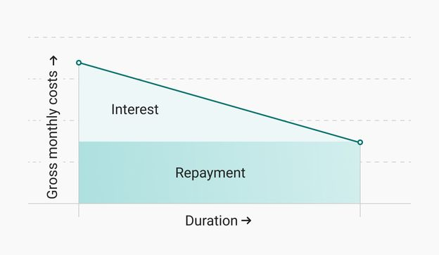
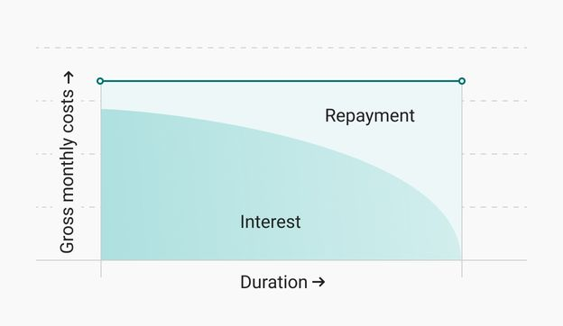

# Mortgage

A mortgage is an agreement between you and a lender that gives the lender the right to take your property if you fail to
repay the money you've borrowed plus interest.

## Glossary

* **Principal:** the outstanding balance of the mortgage, meaning the amount that was borrowed initially minus what was 
  already paid back

* **Interest (*rente*):** the money that we pay to the bank as a price for lending us the money. It is proportional to
  the principal (based on the annual interest rate).
  * For each payment, the interest is `P * r * d` where `P` is the principal, `r` is the annual interest rate, and `d` is
  the duration in years over which the interest is applied.
  For monthly payments, the interest is therefore `P * r / 12`.

* **Principal payment / repayment (*aflossing*):** the part of a payment that reimburses what we borrowed. The principal
  goes down by that amount when we pay. Together with interest, it makes up the total payment we make to the bank every
  month.

* **NHG**: [Nationale Hypotheek Garantie](https://www.nhg.nl/english-summary/) (National Mortgage Guarantee).
  It is a government initiative that allows buyers to get smaller interest rates, but it is only applicable to 
  homes that are under 405,000€ (or under 429,300€ for A+++ energy ratings).

* **Loan-to-value (LTV) ratio:** the ratio of the principal amount to the market value of the property. It may be used
  for the initial interest rate calculation, or to update the rate throughout the mortgage. A lower LTV ratio means less
  risk for the lender, and therefore they offer lower interest rates as a result.

* **WOZ value:** the value of the property according to the Real Estate Valuation Act (Wet Waardering Onroerende Zaken).
  Each year, the value of all real estate in Amsterdam is assessed again, for tax purposes (and mortgages).
  It is visible on the tax assessment, and can also be checked on [wozwaardeloket.nl](https://www.wozwaardeloket.nl/).
  Properties that are being constructed don't have a WOZ value yet, so most banks use the actual price (including 
  the expected additional work) as the property value for their calculations (such as for the LTV ratio). 

## Mortgage types (repayment distribution)

### Main mortgage types

#### Linear mortgage

The repayment of the principal amount is the same every month (total divided equally between all the months in the 30
years). Due to the interest being big at the start and getting smaller, this means that the effective **monthly payment
is big initially, and decreases over time.**

**Example:** you borrow 360.000€ over 30 years with an annual interest rate of 3%.
With a linear repayment, you will pay back 360.000 / (30 * 12) = 10.000€ per month on the principal.
However, every month, you will need to pay interest in addition to that, based on how much you still have to reimburse
and on the interest rate.
 * The 1st month, you pay interest on the whole 360.000€ for a month, which means 360.000 * 3% / 12 = 900€.
   So the total payment for the first month is 10.000€ + 900€ = 10.900€. 
 * The 2nd month, the mortgage balance is only 350.000€ because you already paid back 10.000€ on the principal.
   The interest will therefore be 350.000 * 3% / 12 = 875€.
   So the total payment for the 2nd month is 10.000€ + 875€ = 10.875€. 

#### Annuity mortgage

The repayment of the principal amount is adjusted (small at the beginning and gets bigger afterwards) to compensate the
variation in the interest, so that the effective monthly payment is constant.

#### Combined option

We can opt for a mortgage that would be partially linear and partially annuity (by splitting it into multiple parts).

### Taxes

For the annuity and linear options, interest is tax-deductible. Some other options exist but with non-deductible
interest.

### Extra payments

It’s possible to make extra voluntary repayments. In most banks, we can pay up to 10% of the initial total loan
penalty-free per year. When making a voluntary repayment, we can choose on which mortgage part we’re doing it. In this
case, the limit is only 10% of that part. Some banks like Obvion allow unlimited voluntary repayments so long as the
money comes from our own resources (meaning we can prove it’s not borrowed from another bank).

## Interest rates

### General info

* No negotiation possible: a bank can’t do different rates for different people, but interest rates differ between banks

* Interest rates are lower if we don’t borrow the full value of the property: there are different mortgage classes or 
  “tariefgroups” based on the loan-to-value (LTV) ratio. Some banks (like Obvion) even dynamically adjust the interest
  rate during the course of the mortgage depending on the changing LTV ratio. Every month (for Obvion, the 1st of the
  month) the LTV ratio is calculated based on the current balance and the current WOZ value of the property.

* The interest rate can be fixed for a certain amount of time. Different periods give different rates. At the time of 
  writing, the lowest rates are obtained when fixed for 5 years, they are higher if we fix them for shorter or longer.
  Around 3 months before the end of the period, the bank contacts the client to agree on a new fixed rate for a new
  (potentially different) period based on the current market.
  * Note: with banks adjusting the rate dynamically based on the loan-to-value ratio, like Obvion, we don't actually fix
    a single rate for the period, but instead we fix a group of rates (1 rate per LTV ratio range).
    Within the "fixed rate" period, the effective interest rate goes down when the LTV ratio passes some thresholds. 

* It is usually possible to choose different fixed-rate periods (and thus rates) for different parts of the mortgage.
  For example, 25% of the mortgage with a rate fixed for 5 years, 50% fixed for 10 years, and 25% fixed for 20 years.
  
* The interest rate has a bigger impact at the beginning of the mortgage when the principal is big, and is less
  important towards the end of the mortgage. It's good to keep in mind when evaluating risk when fixing the rate for a
  period: if the rate increases in 10 years, maybe it won't be a big deal.

### Day-count conventions

Since we pay interest every month, and not every year, the annual interest rate must be prorated to the duration of 
the months. There are several different ways to do this, referred to as 
[Day-count conventions](https://en.wikipedia.org/wiki/Day_count_convention).

For example, we can decide that the annual rate should be divided by 12, and this gives 12 equal months. We could also
take into account the actual number of days in each month, which gives a higher weight to January than February.

A common way to calculate is to consider that every month is 30 days, and that a year is 360 days.
This is the **30/360 convention**. There are multiple variants of it depending on how we account for February 28th/29th
and for the 31st of months that are not _actually_ 30 days.

Using a 30/360 convention gives us equal months, and makes it easy to define annuity mortgages for which the monthly
payment is constant, because we can apply an interest rate of $\frac{1}{12}$th of the annual rate to each month. 

## Special case of new constructions

* The first bill (to pay the land, development costs, advisor fees, etc.) is to be paid when the contract is signed at
  the notary’s. We use our own money first, and the remaining amount is paid with money from the loan. The rest of the
  borrowed money is placed on a construction account (a.k.a construction fund), which will be used to pay construction
  bills. Each time we receive a bill from the contractor, we forward it to the bank, which pays the contractor directly
  with money from the construction fund.
  * Note: if our own funds exceed the initial bill, nothing is taken from the loan to pay that bill, and the whole loan
    is placed on the construction account, along with the excess from our own funds.
* We start paying back the loan to the bank starting from the first bill signed at the notary’s. By law, the mortgage is
  tied to the purchase of the property so it has to start even if we paid the first bill entirely with our own money 
  (it’s also a condition for the interest to be tax-deductible). Interest on the whole loan has to be paid from the
  moment of the signature at the notary’s, but redemption is only paid starting from the first complete month. The first
  payment to the bank is made at the end of the first complete month.
  * Example: if we sign on November 20th at the notary’s, we owe interest for the 10 days of November, and
    redemption+interest for the complete month of December. We pay all of this to the bank at the end of December (the
    first complete month).
* Because we don't have access to the money on the construction account, we earn interest on it with the same interest
  rate as the mortgage. This is deducted from the payments we have to make to the bank, so it feels as if we only pay
  interest on the amount of the mortgage that has actually been spent to pay bills so far.
  There is a nuance here, though: the interest earned in a month is actually deducted from the payment of the next
  month, so nothing is deducted from the first payment. Up to the end of the first complete month (December in our
  case), the interest from the construction account is credited on the construction account itself, and is then deducted
  from the next payment. In our case, the interest earned in the partial November and the full December is deducted from
  the payment made in January.
* The last bill is paid when the keys are given to us. Once the first occupant moves in, we reach the point where we
  “borrowed everything” and start paying interest on the whole mortgage (minus what we already paid back).
